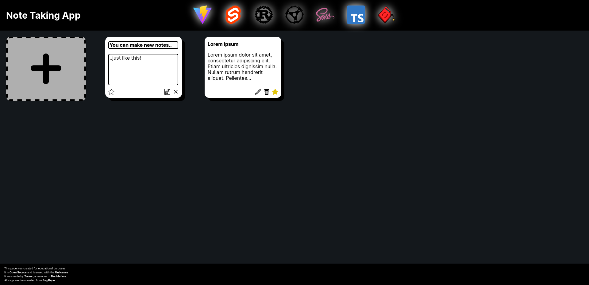

# Note Taking App

I wanted to learn more about fullstack development and backend / frontends in general, so I thought I would start with a classic - the note taking app!



Requirements:

- Diesel CLI
- Npm
- Rust

Running:

1) Make a .env file similar to below (or set environment variables)
2) `cd frontend && npm install`
3) `npx vite build`
4) `cd ..`
5) `disel setup`
6) `diesel migration run`
7) `cargo run`

Example /.env file:

```.env
DATABASE_URL="your_database_file.sqlite"
```

Todo:

- [X] Basic Actix setup
- [X] Database intergration
- [X] Creating notes
- [X] Retrieving notes
- [X] Updating notes
- [X] Deleting notes
- [X] Frontend intergration
- [?] Tags / filtering (PostgreSQL)
- [?] Serve files from the server

Credits:

- The code - moi
- Moral support - Danub
- Fixing my dumb mistake - [jub0bs](https://stackoverflow.com/a/73391188/17303382)
- UI Inspiration - [Nikola Cvetkovski](https://medium.com/the-web-tub/making-a-simple-note-app-using-svelte-and-vite-27edfa91a591)
- Tech stack inspiration - [nelsontkq](https://github.com/nelsontkq/actix_svelte_template)
